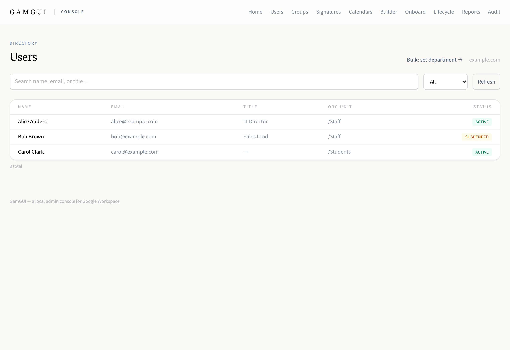
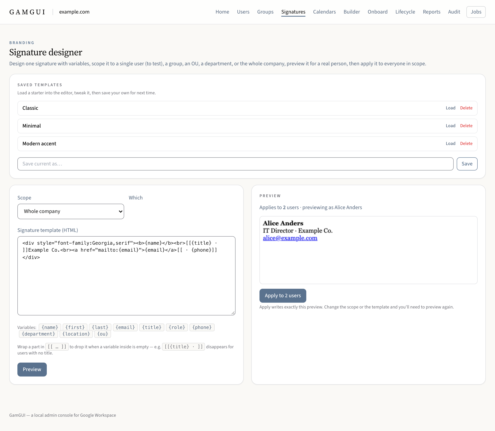
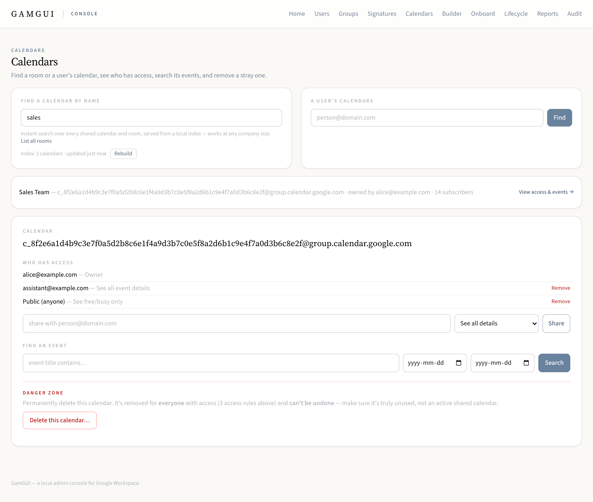
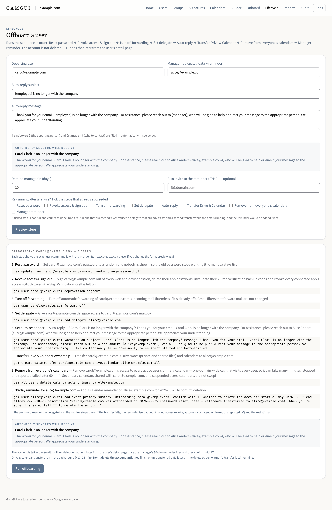

# GamGUI

A free, local, open-source **macOS GUI for [GAM7](https://github.com/GAM-team/GAM)** — administer
Google Workspace (users, groups, signatures, delegates, vacation responders, reports, and more)
without memorizing CLI commands, with your credentials kept in the macOS **Keychain**.

> GAM exposes far more of Google Workspace than the Admin Console surfaces (Gmail
> signatures/delegates/forwarding, advanced group settings, bulk operations, reporting). GamGUI
> puts a safe, native front end on top of it.

<!--
Screenshots: drop PNGs into docs/screenshots/ (see that folder's README for the recommended shots),
then uncomment these to show them here:




-->

## Status

Actively developed and used against live Google Workspace tenants. Working today:

- **Setup wizard** — either **import an existing GAM install** (it auto-detects `$GAMCFGDIR`,
  `~/.gam`, and its own setup dir, shows which credential files each one holds, and moves them into
  the Keychain) or follow the guided fresh GAM project / OAuth flow; then the manual
  domain-wide-delegation step and a verify.
- **Users** — fast list/search/detail (cached + paginated), profile editing (title/department —
  location is shown but not editable) with a bulk "assign store" tool, mailbox **delegates**,
  **vacation responders**, group membership, per-user calendar sharing (grant/revoke access to that
  person's own calendar), **sign out everywhere**, and a guarded **suspend**.
- **Gmail signatures** — a scoped designer with variables, saved templates, a live preview, and
  bulk apply with a live per-user ✓/✗ feed as each signature gets set.
- **Groups** — membership management, including a drag-and-drop board.
- **Calendars** — find any shared calendar by name. The first time, click **Build index** on the
  Calendars screen: a one-time background scan of every user's calendars (minutes on a large tenant,
  with live progress). After that, name search is instant and served entirely from the local index —
  no live domain scan — and a **Rebuild** button refreshes it (deleting a calendar in the app drops
  it from the index immediately). From there: list every room/resource in the domain, list one
  person's calendars with their access role on each, see who has access and **grant or revoke it** at
  a chosen role. **Sharing also makes the calendar actually appear**, which an ACL alone does not do:
  a person is auto-subscribed, and a **group is expanded and subscribed member by member** as a
  background job with live per-member progress — so nobody is left saying "you shared it but I can't
  see it", and you get the list of anyone it couldn't be added for. Also: search a calendar's events,
  and remove a stray event or an entire orphaned secondary calendar.
- **Lifecycle** — a guided **offboarding** routine (reset password → delegate → auto-responder →
  transfer Drive & calendars → remove from everyone's calendars → reminder on the manager), with a
  live preview of the generated auto-reply.
- **Onboarding** — role → task-list runbooks (persisted, editable) that become a Google Tasks
  checklist on the new hire, plus a templated welcome email.
- **Command Builder** — browse/search the full categorized GAM catalog (~1,040 commands); curated
  commands get typed slots, drag-a-user targeting, a guarded preview → run, linear sequencing, and
  results export (CSV download or straight to a Google Sheet). Result tables slice like grep — a live
  row filter plus an **External only** toggle that keeps just the rows referencing addresses outside
  your domain — and clicking any address in a result offers pre-filled follow-ups (delegates,
  forwarding, vacation, signature, title/dept, reset password, suspend, delete, group add/remove).
- **Reports** — 2SV gaps, inactive accounts, admins, missing recovery, suspended accounts, and
  directory completeness (missing title/department/phone/location), plus a **storage & mail usage**
  panel: top users by Drive/Gmail storage with that day's sent/received counts, from the Reports API
  (which lags a few days).
- **Audit viewer** — every guarded write, searchable with a failures-only filter and CSV export.

You build and run it yourself; it is not yet notarized for distribution to other Macs.

> **Destructive actions are guarded — but check what has actually been proven live.** Suspend,
> account delete, calendar/event delete, data transfer, the offboarding routine, and bulk operations
> all run behind a *preview → typed confirmation → audit-logged* path. That guard is well covered by
> tests; what tests cannot prove is that a given GAM command behaves as expected against a real
> tenant. See [Live verification status](#live-verification-status) for which writes have been
> confirmed against a production domain and which have not — and run anything in the second list
> once on a **throwaway user/event/calendar** before you rely on it. Account deletion is reversible
> only within Google's ~20-day window. GamGUI is provided **as-is under the MIT License, with no
> warranty — use at your own risk**; you are responsible for what you run against your own tenant.

### Live verification status

Every write is audited, so this list is derived from real audit logs rather than memory. "Confirmed
live" means the operation has succeeded at least once against a production Google Workspace domain.

**Confirmed live:** calendar share (ACL) · calendar auto-subscribe (making a shared calendar appear
in someone's sidebar) · add calendar event · delete calendar · add delegate · remove group member ·
reset password · set organization fields · set signature · set vacation · transfer data · plus all
reads (a read-only pass over the parsers ships as `scripts/acceptance.py`).

**Not yet confirmed live** — treat as unproven and test on a throwaway target first: unshare a
calendar (remove ACL) · remove delegate · clear vacation · add group member · sign out everywhere ·
delete event · delete user · the group fan-out of a calendar share (the individual calls it makes —
ACL add and subscribe — are each confirmed live, but the group expansion itself is not) · and the two
offboarding repairs described below.

**Known-good repairs awaiting live re-run.** Two offboarding bugs were found in real audit logs and
fixed, but the fixes have not themselves been exercised live yet: Drive and calendar are now
transferred in a *single* data-transfer call (two separate calls collided with a `409 conflict`),
and "remove from everyone's calendars" now tolerates the `cannotChangeOwnAcl` error that used to
abort the sweep.

## Design goals

- **Local & native** — a single bundled `.app`; no cloud service, nothing leaves your machine. The
  UI is served by a loopback-only local server on a random port, gated by a per-launch token (see
  [Security model](#security-model)).
- **Secure** — secrets live in the macOS Keychain; GAM's plaintext credential files are
  materialized into a locked-down temporary directory only for the duration of each `gam`
  invocation, then wiped. ([details](#security-model))
- **Easy but powerful** — form/table UI for the common painful tasks, full GAM power underneath.
- **Connector-ready** — built around a connector protocol, so the Google Workspace connector is
  cleanly isolated and other systems could be added later without touching the UI.

## Architecture

```
HTMX views → FastAPI routes → Services → Connector protocol → GAMConnector
                                              → GAMRunner (subprocess)
                                              → SecretsVault (Keychain) + EphemeralConfig (temp GAMCFGDIR)
```

Wrapped in a `pywebview` native window (WKWebView). See [CONTRIBUTING.md](CONTRIBUTING.md) for the
layout and conventions, and [docs/builder-commands.md](docs/builder-commands.md) for the Builder
catalog.

## Security model

GAM stores credentials as plaintext files (`client_secrets.json`, `oauth2.txt`,
`oauth2service.json`) in its config dir. `oauth2service.json` can impersonate **any** user in the
domain and `oauth2.txt` is effectively an admin password, so GamGUI:

1. keeps the canonical copies in the **Keychain** (`keyring`, device-bound, not synced);
2. materializes them into a `chmod 700` temp dir (files `chmod 600`) set as `GAMCFGDIR` only for
   each `gam` call;
3. wipes that dir on completion (success or failure) — and, because "the app quit mid-call" is the
   case that actually strands plaintext credentials, also via an `atexit` hook, a graceful-shutdown
   timeout that lets in-flight calls unwind, and an owner-PID marker so a later run can collect a
   directory whose owning process is gone;
4. writes refreshed OAuth tokens back to the Keychain.

Beyond the credentials themselves:

- **The local server is not open to other local processes.** It binds loopback on a random port and
  requires a per-launch token — and because cookies are *not* port-scoped (so `SameSite` alone would
  treat every port on `127.0.0.1` as the same site), it also rejects cross-origin callers outright.
- **GAM is never invoked through a shell.** Every command is an explicit argv list built by
  `GAMCommands`; user input is always a single list element, never string-interpolated.
- **Every mutation is guarded and audited** — `guard.evaluate()` classifies risk and resolves the
  concrete affected set for a preview, and the write is appended to a local audit log.
- **The vendored `gam` binary is checksum-pinned and verified fail-closed.** A release asset with no
  committed pin is refused rather than installed, since a swapped binary would inherit
  domain-wide impersonation.

## Build from source

Requirements: **Python 3.10+** and **macOS** (to run the native window; the test suite itself runs on
Linux too). No Google credentials are needed to build or test.

```bash
git clone <repo-url> && cd gamgui
make setup     # create .venv, install dev + native-window deps
make gam       # vendor the pinned GAM7 binary into gamgui/resources/gam7 (needs network)
make test      # offline test suite — uses a mock gam, no binary/credentials required
make run       # launch the app (native window; prints a browser URL if pywebview is absent)
```

`make setup` builds the venv with whatever `python3` is first on your PATH — macOS's bundled
`python3` is 3.9 and `pip install -e .` will refuse it ("requires a different Python"). If
`python3 -V` is below 3.10, skip `make setup` and create the venv explicitly:

```bash
python3.14 -m venv .venv && .venv/bin/pip install -e ".[dev,desktop]"
```

`make help` lists all targets. Prefer raw commands? `pip install -e ".[dev,desktop]"`, then
`scripts/fetch_gam.sh`, `pytest`, `python -m gamgui.app`. `pip install -r requirements.txt` is an
exact pinned **runtime + basic test** install; the rest of the dev extra (`pytest-timeout`, which the
60s per-test timeout in `pyproject.toml` needs, and `pytest-cov`) only comes with
`pip install -e ".[dev]"`.

The GAM7 binary is **not committed** (platform-specific, large) — `make gam` / `scripts/fetch_gam.sh`
fetches the pinned, tested version from the official releases and verifies it against the committed
checksum (the pin's source of truth is `EXPECTED_GAM_VERSION` — see "Staying current with GAM").

### Build a standalone `.app` (macOS)

```bash
make app       # PyInstaller -> dist/GamGUI.app (bundles Python + the GAM7 binary)
```

For distribution to other Macs you must codesign + notarize the bundle (including the embedded gam
binary); running it yourself needs no signing.

### Stop the Keychain prompts

By default the app is **ad-hoc signed**, so macOS treats each rebuild as a new identity and
re-prompts for the Keychain on every launch — and "Always Allow" never sticks. The fix (no Apple
Developer account needed — that's only for shipping the app to *other* people's Macs) is a **stable
self-signed code-signing cert** named `GamGUI Local`. Once it exists in your login keychain,
`scripts/build_app.sh` signs with it **automatically**, so your one-time **Always Allow** persists
across launches *and* rebuilds.

Create it once, either way:

- **GUI:** Keychain Access → *Certificate Assistant → Create a Certificate…* → name it `GamGUI
  Local`, Identity Type **Self-Signed Root**, Certificate Type **Code Signing**.
- **CLI:**
  ```bash
  D=$(mktemp -d)
  printf '[req]\ndistinguished_name=dn\nx509_extensions=v3\nprompt=no\n[dn]\nCN=GamGUI Local\n[v3]\nbasicConstraints=critical,CA:false\nkeyUsage=critical,digitalSignature\nextendedKeyUsage=critical,codeSigning\n' > "$D/c.cnf"
  openssl req -x509 -newkey rsa:2048 -keyout "$D/k.pem" -out "$D/c.pem" -days 3650 -nodes -config "$D/c.cnf"
  openssl pkcs12 -export -inkey "$D/k.pem" -in "$D/c.pem" -out "$D/id.p12" -passout pass:gamgui-local -name "GamGUI Local"
  security import "$D/id.p12" -P gamgui-local -T /usr/bin/codesign && rm -rf "$D"
  ```

Then rebuild (`make app`). The first launch still asks once **per credential** — click **Always
Allow** on each — and you won't be prompted again, even after future rebuilds. (Override the cert
name with `CODESIGN_IDENTITY=…`. The cert is local and not trusted for distribution by design — it
only quiets your own Keychain.)

The app also caches the three secrets in-process for a sliding window (default 5 min) so a burst of
actions doesn't re-prompt; tune with `GAMGUI_SECRET_CACHE_TTL` (seconds; `0` disables).

### Staying current with GAM (and not breaking on updates)

GamGUI pins a tested GAM7 version — `EXPECTED_GAM_VERSION` in `gamgui/core/gam/commands.py`, matched by
`scripts/fetch_gam.sh`. It never auto-upgrades; you bump deliberately, and three guards keep that safe:

- **Release-watch** (`.github/workflows/gam-watch.yml`, weekly) opens an issue when GAM ships a version
  newer than the pin — awareness, not auto-upgrade.
- **Compat check** (`gam-compat` CI job + `tests/test_command_contract.py`) asserts every GAM
  sub-command our builders use still exists in the vendored command reference, so a renamed/removed
  command fails CI rather than your tenant. A non-blocking `gam-latest-preview` job runs the same check
  against the *newest* GAM as an early warning.
- **Runtime self-check** — if the running `gam` differs from the tested version (e.g. a
  `GAMGUI_GAM_BINARY` override), the setup screen shows a soft warning. It never blocks.

**To bump GAM:**

1. `make gam TAG=vX.Y.Z` (or `./scripts/fetch_gam.sh --tag vX.Y.Z`) — **this first run fails by
   design.** The new release asset has no committed pin yet, so the script downloads it, prints its
   SHA-256, and exits without extracting or installing anything.
2. Add that `<sha>  <asset-name>` line to `scripts/gam_checksums.txt` — exactly as the script prints
   it. Verify the download yourself first; this line is the pin every future fetch is checked
   against, and a swapped `gam` inherits domain-wide impersonation.
3. `make gam TAG=vX.Y.Z` again — now the checksum matches the committed pin, and the binary +
   command reference are vendored into `gamgui/resources/gam7`.
4. Update `EXPECTED_GAM_VERSION` (`gamgui/core/gam/commands.py`) and `TAG` (`scripts/fetch_gam.sh`);
   `.venv/bin/python scripts/build_command_catalog.py` to regenerate the browse catalog.
5. `make test` — the command-contract, catalog-matches-grammar, and pinned-version-consistent tests
   flag any sub-command that changed or any version string left behind.
6. Skim `gamgui/resources/gam7/GamUpdate.txt` for breaking changes.
7. `.venv/bin/python scripts/acceptance.py` against a tenant — read-only; the true output-shape check.
8. Commit.

Steps 1–3 are not busywork: the fetch is fail-closed precisely so "no pin for this asset name" can
never be silently upgraded to trust-on-first-use. There is an escape hatch —
`./scripts/fetch_gam.sh --tag vX.Y.Z --allow-unpinned` installs without verifying (it isn't reachable
through `make gam`) — and it exists for CI's throwaway `gam-latest-preview` job. Never use it for a
build you intend to run against a real domain.

### Tests & CI

`pytest` is fully offline (mock gam + in-memory Keychain). CI runs it on Ubuntu and macOS across
Python 3.10, 3.12, and 3.14 — see [`.github/workflows/ci.yml`](.github/workflows/ci.yml).

**Static analysis.** CodeQL runs on every push and PR to `main`, plus weekly, over both the Python
code and the workflows themselves — configured in-tree so it is reviewable rather than hidden in
repository settings: [`.github/workflows/codeql.yml`](.github/workflows/codeql.yml) with
[`.github/codeql/codeql-config.yml`](.github/codeql/codeql-config.yml). It uses the broader
`security-extended` suite, and skips `tests/`, the vendored GAM release, and vendored browser
libraries — the config explains why for each.

## Email signatures

The **Signatures** screen designs one HTML signature with variables, previews it rendered for a real
person, and applies it in bulk — scoped to a single user (for testing), a group, an org unit, a
department, a location, or the whole company. Each user's current signature is also shown *rendered*
on their detail page.

**Template variables** (filled per user from the directory):
`{name}` `{first}` `{last}` `{email}` `{title}` (`{role}` is an alias) `{phone}` `{department}`
`{location}` `{ou}`. Wrap a fragment in `[[ … ]]` to drop it when a variable inside is empty — e.g.
`[[{title} · ]]` vanishes for people with no title, so one template can roll out before every profile
is filled in.

### Hosting signature images (logo, social icons)

Gmail does **not** allow inline/base64 images or Google Drive links in signatures — every image must
be a file at a **public HTTPS URL**. GamGUI is a local app and doesn't host images itself; you point
the template's `` at wherever you host them. Whatever host you choose, the URL must be:

- **HTTPS** and **anonymously reachable** — Gmail fetches images through its own proxy (no
  cookies/referer) and caches them. Test a URL in a private/incognito window; if it loads there,
  Gmail can fetch it.
- served with the correct **`Content-Type`** (`image/png`, …) and **no hotlink/referer protection**
  — referer-based protection is the usual cause of "the logo shows for me but not for recipients."
- **versioned by filename** when an image changes (`logo-2026.png`) — Gmail caches by URL, so
  overwriting the same name can keep serving the old one.

Size icons ~2× their display size and set explicit `width`/`height` on each ``.

**Where to host — pick one:**

- **A web host you already have (simplest).** Drop the files in a public folder, e.g.
  `https://yourdomain.com/email/logo.png`. Done.
- **Google Cloud Storage** (Google-native; reuse the GCP project GAM created). Requires a **billing
  account** linked to the project — but small signature assets fall under the Always-Free tier, so
  the bill rounds to **$0**:
  1. Cloud Console → **Billing** → link a billing account to the project (if not already).
  2. **Cloud Storage → Create bucket** — globally-unique name, a US region, Standard class, Uniform
     bucket-level access.
  3. Make objects public: bucket **Permissions → Grant access → principal `allUsers` → role
     `Storage Object Viewer`**. (If your org enforces *Public access prevention*, allow it on this
     bucket.)
  4. Upload the images.
  5. Reference them at `https://storage.googleapis.com/<bucket>/<path>/logo.png`.
  (Pricing changes — confirm the current free-tier limits, but for a handful of small PNGs it is
  effectively free.)
- **GitHub + jsDelivr (free, no billing).** Commit the images to a public repo and serve them via the
  jsDelivr CDN: `https://cdn.jsdelivr.net/gh/<user>/<repo>@<branch>/path/logo.png`. CDN-fast, no card.
- **Cloudflare R2 / Amazon S3** — or any public-object store — also work.

## Where this is going

[ROADMAP.md](ROADMAP.md) — the ranked backlog, plus the trade-offs behind what it does *not* do yet.
[CONTRIBUTING.md](CONTRIBUTING.md) — layout, conventions, and how to add a Builder command.
[SECURITY.md](SECURITY.md) — threat model, the invariants the code is expected to hold, and how to
report a vulnerability privately.
[CLAUDE.md](CLAUDE.md) — the operational invariants, written for an AI coding agent but the fastest
way for a human to learn what this codebase refuses to do and why. Each entry exists because
something broke once.

## License

MIT — see [LICENSE](LICENSE).
